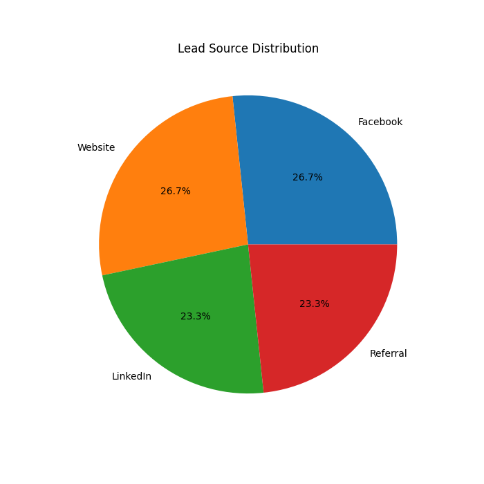
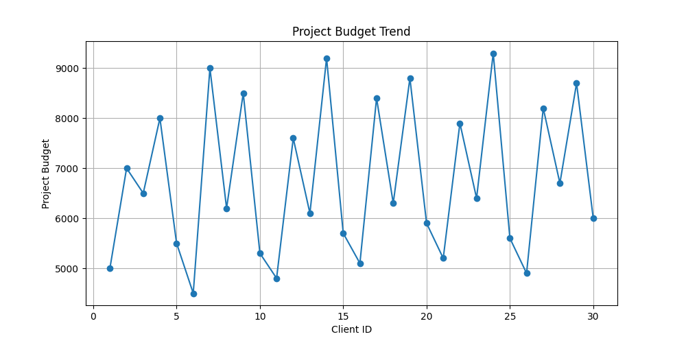
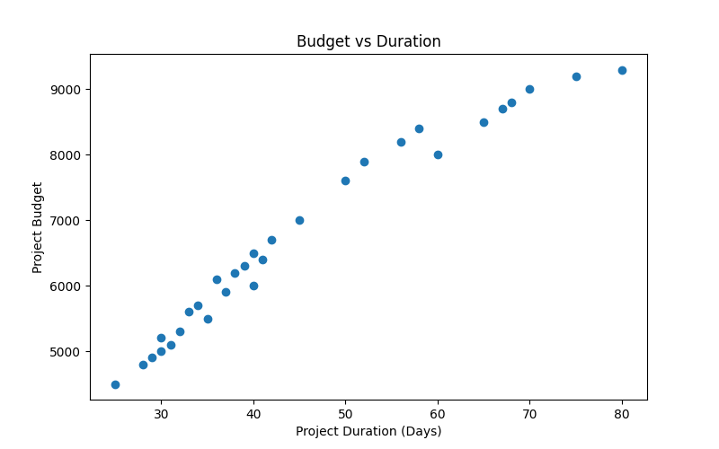

# ai-task-5-intership-# Task 5 Data Visualization

## Dataset
coretech_clients_cleaned.csv

## Charts Created

### 1. Bar Chart - Clients by Service
Shows number of clients using each service.

### 2. Pie Chart - Lead Source Distribution
Shows client acquisition sources.

### 3. Line Chart - Project Budget Trend
Shows budget variation among clients.

### 4. Histogram - Ratings Distribution
Shows frequency of client ratings.

### 5. Scatter Plot - Budget Analysis
Shows relationship between duration and budget.

